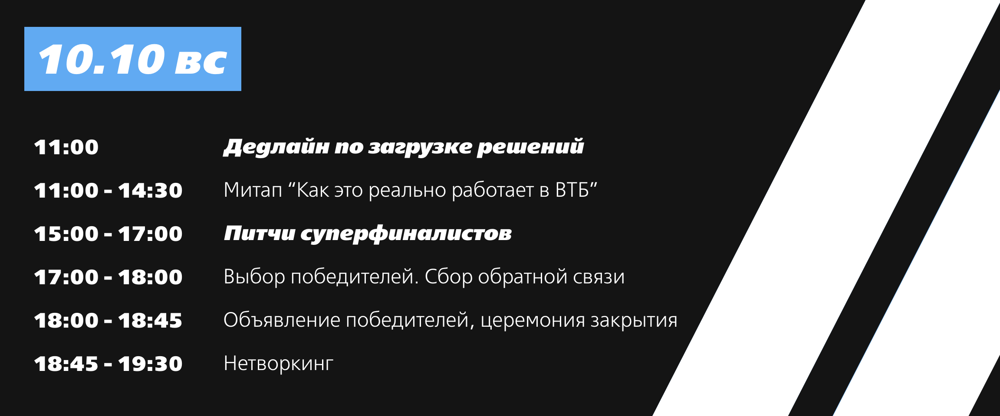

## iOS приложение для хакатона VTB MORE Tech 3.0
### Сайт хакатона [moretech.vtb.ru](https://moretech.vtb.ru/)
### Правила
* Пуш, но не забывай пуллить (© @nickaroot 2018 год)
* В main не пушим, только отдельно подливаем dev
* Для остального можно делать ветки от dev 
* Интерфейс попробуем без сторибордов, добавил snapkit в podfile
### Задание
Для привлечения новых клиентов в продукт "Инвестиции", необходимо преодолеть внутренние барьеры потенциальных клиентов о том, что инвестиции - это слишком сложно, страшно и т.д. и повысить финансовую грамотность аудитории.

Отсюда вытекает потребность в разработке мобильного приложения или мобильной игры “финансовый наставник”, который в игровой форме поднимет уровень финансовой грамотности широкой аудитории.

Игра или приложение должно быть понятно широкой аудитории, развивать базовые навыки инвестирования, иметь возможность взаимодействовать с окружением, чтобы вовлекать больше пользователей.
### Расписание

### Рекомендуемые компетенции в команде:
Mobile-разработчик / GameDev
Аналитик — изучение проблематики, разработки методики обучения пользователей, исследования ЦА
Backend-разработчик — если потребуется обмен с сервером для реализации вашей идеи

Этот набор ролей — рекомендация, вы можете собирать команду так, как считаете нужным для реализации вашей идеи.

Более подробные детали будут раскрыты уже на самом хакатоне!
